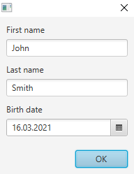
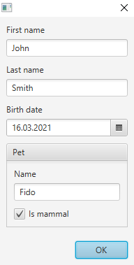

# Automatic UI generation with Scala 3's type class derivation

Scala 3 has a lot of cool new features. Among those is so-called [type class derivation](http://dotty.epfl.ch/docs/reference/contextual/derivation.html), which isn't really a single feature in itself, but rather a set of low-level technologies that enables the automatic implementation of type classes for certain composite types.

Basically if we have a type class (or trait) like `trait Foo[A]`, we can use these technologies to write code that implements `Foo` for any given `A`, if `A` is a product type (e.g. `case class`) or sum type (e.g. `enum`).

Can we (ab)use this for automatic user interface generation?

For instance, say we have:

```scala
case class Person(firstName: String, lastName: String, birthDate: LocalDate)
```

can we write code that enables us to use a simple one-liner like:

```scala
val dialog = new DerivedDialog[Person]
```

to automatically generate a dialog like this:



Yes, we can, and it this article we will see how.

## Type class derivation basics

Let's first see how this type class derivation machinery works by implementing something simpler. Consider the following type class:

```scala
trait Transformer[T]:
  def f(t: T): T
```

This has a single method that simply transforms a value into a another value of the same type. We use this just as an example, but it also has some similarity with the process of editing a value via a user interface, so it's not a bad place to start.

Now we can create given instances of this for some primitive types:

```scala
given Transformer[String] with
  def f(x: String) = x.toUpperCase

given Transformer[LocalDate] with
  def f(x: LocalDate) = x plusDays 1
```

If we also create a utility method like:

```scala
def transform[A : Transformer](a: A) = summon[Transformer[A]].f(a)
```

we can transform primitive values like this:

```scala
scala> transform("foo")
val res0: String = FOO

scala> transform(LocalDate.of(2021, 1, 1))
val res1: java.time.LocalDate = 2021-01-02
```

However, if we try to transform an instance of the `Person` class defined above, we get:

```scala
scala> transform(Person("John", "Smith", LocalDate.now))
1 |transform(Person("John", "Smith", LocalDate.now))
  |                                                 ^
  |no implicit argument of type transformer.Transformer[Person] was found for an implicit parameter of method transform
```

which is expected, since we have not implemented a `Transformer` for `Person`.

We could of course quite easily write a `Transformer[Person]`. But it's tedious, and programmes hate tedious work. So what if we instead could find a way to automatically create a `Transformer` not only for the `Person` class, but for any case class, given that we already have transformers for the individual elements of that class?

Here's how we can do that with the new Scala 3 features:

```scala
inline given [A <: Product] (using m: Mirror.ProductOf[A]): Transformer[A] =
  new Transformer[A]:
    val elemTransformers = summonAll[Tuple.Map[m.MirroredElemTypes, Transformer]].toList.asInstanceOf[List[Transformer[Any]]]  
    def f(a: A): A = 
      val elems = a.productIterator.toSeq
      val transformed = elems.zip(elemTransformers) map { case (elem, transformer) => 
        transformer.f(elem) 
      }
      val tuple = transformed.foldRight[Tuple](EmptyTuple)(_ *: _)
      m.fromProduct(tuple)      
```

There's a bit of stuff going on here. Notable new features being used are:

* `inline`
* `Mirror`
* some `Tuple` features

Let's look at it in a little more detail. `Mirror.ProductOf` is synthesized automatically by the compiler for all product types (e.g. case classes), so it will always be available here. This class contains meta-information about the case class that we can use for inspecting it.

First we summon given instances for `Transformer` each of the element types of the case class:

```scala
val elemTransformers = summonAll[Tuple.Map[m.MirroredElemTypes, Transformer]].toList.asInstanceOf[List[Transformer[Any]]]  
```

 For the `Person` class `m.MirroredElemTypes` will be `(String, String, LocalDate)`. Using `Tuple.Map` we turn that into `(Transformer[String], Transformer[String], Transformer[LocalDate])` which we in turn pass (as a type) to Scala's `summonAll` method. This returns a `Tuple` containing corresponding given instances for these types. We turn that tuple into a list (and explicitly remind the compiler of the type of that list).

Then we can implement the transformation method `f`. This takes an actual instance of the class we are operating on, such as a `Person`, and returns a new instance of that class, with the elements transformed by the individual transformers. First we put all the elements of the class into a list, and then we map each element with the corresponding transformer instance:

```scala
val elems = a.productIterator.toList
val transformed = elems.zip(elemTransformers) map { case (elem, transformer) => 
  transformer.f(elem) 
}
```

 Finally we put the resulting list back into a tuple, and use the `fromProduct` method on the `Mirror` to create an instance of the case class from the tuple:

```scala
val tuple = transformed.foldRight[Tuple](EmptyTuple)(_ *: _)
m.fromProduct(tuple)      
```

And that's it! I have to admit to not completely understand how the `inline` stuff works, but the gist of it is that it allows the compiler to do the necessary type-level ~~magic~~ logic. So now we can do:

```scala
scala> transform(Person("John", "Smith", LocalDate.of(2000, 1, 1)))
val res1: Person = Person(JOHN,SMITH,2000-01-02)
```

The nice thing is that it already works recursively, which means that if we define our classes like:

```scala
case class Pet(name: String, isMammal: Boolean)
case class Person(firstName: String, lastName: String, birthDate: LocalDate, pet: Pet)
```

and make sure we have transformers for all primitive elements with: 

```scala
given Transformer[Boolean] with
  def f(x: Boolean) = !x
```

we can just do:

```scala
scala> transform(Person("John", "Smith", LocalDate.of(2021, 1, 1), Pet("Fido", true)))
val res0: Person = Person(JOHN,SMITH,2021-01-02,Pet(FIDO,false))
```

## User interfaces in JavaFX

For the actual user interface generation we will use [JavaFX](https://openjfx.io/), but the technique could probably be easily ported to other toolkits. Let's first take a quick look at how to create user interfaces in JavaFX manually. 

JavaFX uses a "scene graph" which is a tree-like hierarchy of `Node`s. Nodes can be "controls" like text fields and check boxes, or layout containers (or other elements not relevant here). For editing a `Person` like the one defined above, we could write the following code:

```scala
  val firstNameField, lastNameField = new TextField
  val birthDatePicker = new DatePicker

  val content = new VBox(10) {
    getChildren.addAll(
      new VBox(5, new Label("First name"), firstNameField),
      new VBox(5, new Label("Last name"), lastNameField),
      new VBox(5, new Label("Birth date"), birthDatePicker)
    )
  }
```

and then put the `content` inside a `Dialog`, which is not shown here.

The `Person` + `Pet` example would be slightly more complex. Actually, I find it too tedious to write the code for that right now, so let's just move on and automate it instead.

## Generating the UI

For editing the contents of a case class we need to generate an input control for each element in the class, corresponding to the type of the element. So that for `String` we need a `TextField` and for `Boolean` we need a checkbox, and so on. We also need to be able to set and retrieve the value of the control, as well as render it on the scene graph.

We start by putting these requirements into a simple type class:

```scala
trait Editor[T]: 
  def getValue: T
  def setValue(x: T): Unit
  def container(label: String): Container
```

The `Container` is just an intermediate step for abstracting away rendering of the nodes onto the scene graph. We define it like this:

```scala
enum Container(label: String):
  case Primitive(label: String, node: Node) extends Container(label)
  case Composite(label: String, containers: Seq[Container]) extends Container(label)
```

Then we implement instances of `Editor` for some primitive types:

```scala
given Editor[String] with
  val textField = new TextField
  def getValue = textField.getText
  def setValue(x: String) = textField.setText(x)
  def container(label: String) = Container.Primitive(label, textField)

given Editor[LocalDate] with
  val datePicker = new DatePicker
  def getValue = datePicker.getValue
  def setValue(x: LocalDate) = datePicker.setValue(x)
  def container(label: String) = Container.Primitive(label, datePicker)
```

Now we can write the derivation of `Editor` for any case class:

```scala
  inline given [A <: Product] (using m: Mirror.ProductOf[A]): Editor[A] =
    new Editor[A]:
      val labels = constValueTuple[m.MirroredElemLabels].toList.asInstanceOf[List[String]]
      val elemEditors = summonAll[Tuple.Map[m.MirroredElemTypes, Editor]].toList.asInstanceOf[List[Editor[Any]]]
      val containers = labels.zip(elemEditors) map { case (label, editor) => editor.container(label) }
      def getValue = 
        val values = elemEditors.map(_.getValue)
        val tuple = values.foldRight[Tuple](EmptyTuple)(_ *: _)
        m.fromProduct(tuple)            
      def setValue(a: A) =
        val elems = a.productIterator.toSeq
        elems.zip(elemEditors) foreach { case (elem, editor) => 
          editor.setValue(elem)
        }
      def container(label: String) = Container.Composite(label, containers)
```

This is very similar to the derivation of `Transformer`. The one additional feature used is that here we also get the element labels using `constValueTuple[m.MirroredElemLabels]` so that we can render these on the UI. 

Finally, we need a way to render the UI elements to the scene graph. We want this to customizable, so we create a trait `Layouter` that takes a `Container` and returns a JavaFX `Node`:

```scala
trait Layouter:
  def layoutPrimitive(primitive: Container.Primitive): Node
  def layoutComposite(composite: Container.Composite): Node
  def layout(container: Container): Node = container match 
    case primitive: Container.Primitive => layoutPrimitive(primitive)
    case composite: Container.Composite => layoutComposite(composite)
```

We also provide a default implementation for it:

```scala
object DefaultLayouter extends Layouter:
  def layoutPrimitive(primitive: Container.Primitive) =
    VBox(5, new Label(primitive.label), primitive.node)
  def layoutComposite(composite: Container.Composite) =      
    VBox(10, composite.containers.map(layout)*)
```

There is one crucial thing missing. The documentation for given instances says that:

*"A given instance without type or context parameters is initialized on-demand, the first time it is accessed. If a given has type or context parameters, a fresh instance is created for each reference."*

This means that if we have several `String` elements in our case class, only one `given Editor[String]` will be created. This is clearly not what we want, since there then also will be only one `TextField` shared by those element. Instead, we want to create a fresh instance of `Editor[String]` for each reference.

We can achieve that by using a dummy context parameter. With some clever naming, it also reads quite well:

```scala
trait FreshInstance

object FreshInstance:
  given FreshInstance = new FreshInstance {}

given (using FreshInstance): Editor[String] with ...
```

We conclude by setting up a `Dialog` like this:

```scala
class DerivedDialog[A >: Null : Editor](value0: Option[A] = None) extends Dialog[A]:

  val editor = summon[Editor[A]]
  val layouter = DefaultLayouter

  val content = layouter.layout(editor.container(""))

  getDialogPane.setContent(content)

  getDialogPane.getButtonTypes.add(ButtonType.OK)

  setResultConverter { (dialogButtonType: ButtonType) =>
    if (dialogButtonType == ButtonType.OK) editor.getValue
    else null
  }

  value0 foreach editor.setValue

end DerivedDialog
```

and with an additinal primitive `Editor[Boolean]`, some tweaking of "camel cased" label strings, and some enhancements to the container/layouter logic (all which are left as exercises for the reader, or you can see the complete code here), we can simply call:

```scala
new DerivedDialog(Some(Person("John", "Smith", LocalDate.now, Pet("Fido", true))))
```

to generate this dialog:

